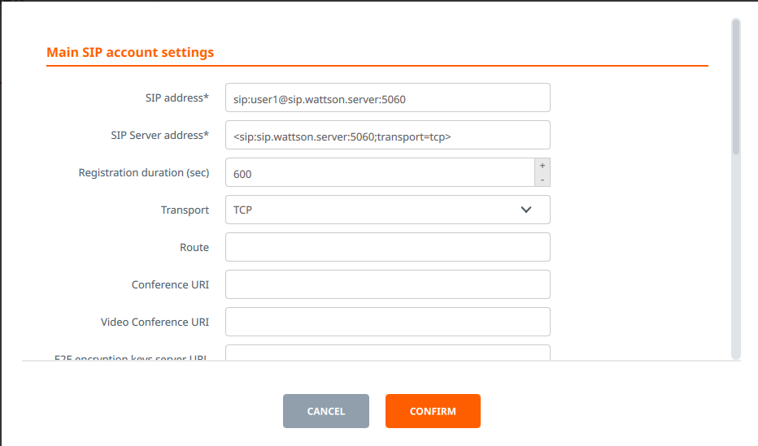

# SIP Service

Starts a SIP server on a prepared docker container (wattson-sip).

See the wattson-docker repo for documentation on the container.

The Service takes the following arguments:

```
"ip": "!ip"
"port": 5060
"fqdn": "sip.wattson.server"
"user_list":
- "name": "user1"
  "domain": "sip.wattson.server"
  "password": "user1pw"
  "aliases":
  - "alias_name": "1234567"
    "alias_domain": "sip.wattson.server"
```

With linphone you can log in as user1 with the following config:



