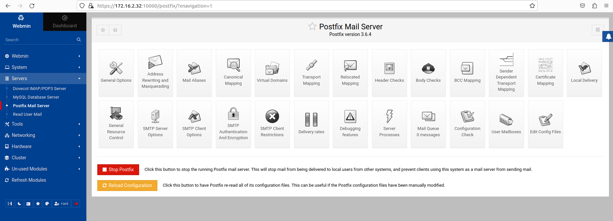

# Webmin service

A browser based UI hosted on port 10000.

Username: root

Password: wattson

These can be changed in the respective Docker file before building.

Here is an example of webmin on the mail server.

Be sure to click "Refresh Modules".

