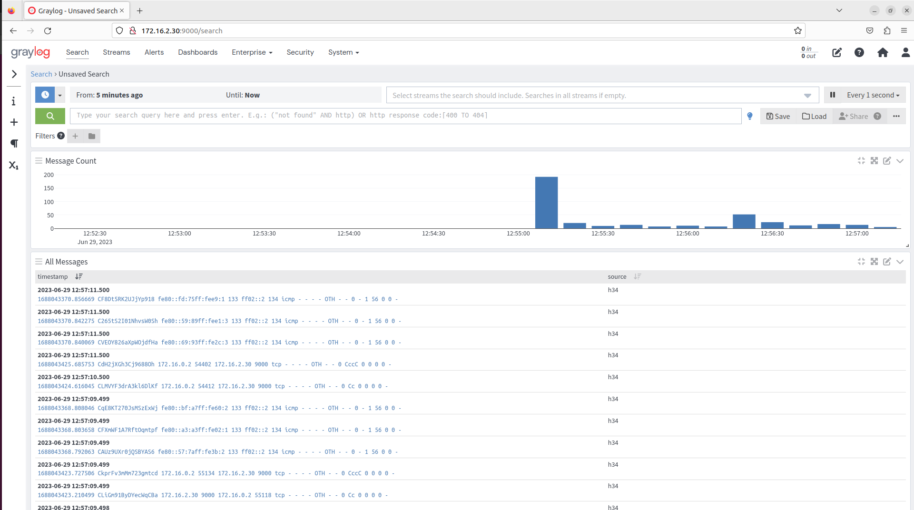

# Zeek in Wattson

## Introduction

This document aims to provide an explanation on how to add a Docker Host with Zeek to Wattson.

## General Steps

1. Add Docker Host (e.g. via python extension)
2. Add monitoring.wattson_zeek.py as a service
3. After starting open firefox and connect to graylog UI
4. Log in with credentials from server.conf
5. Click on System > Inputs at the top.
6. Add a new input of type beat; give it a name and submit
7. Graylog will find the filebeat installed on the container
8. Filebeat will forward the logs from zeek to graylog.

Step 5 can also be done by following the notification from graylog once it realizes that there's an unused Beat on a node.
That can take a few seconds.

After clicking on "Search" and setting the update rate in the upper right corner you should see something like this:

